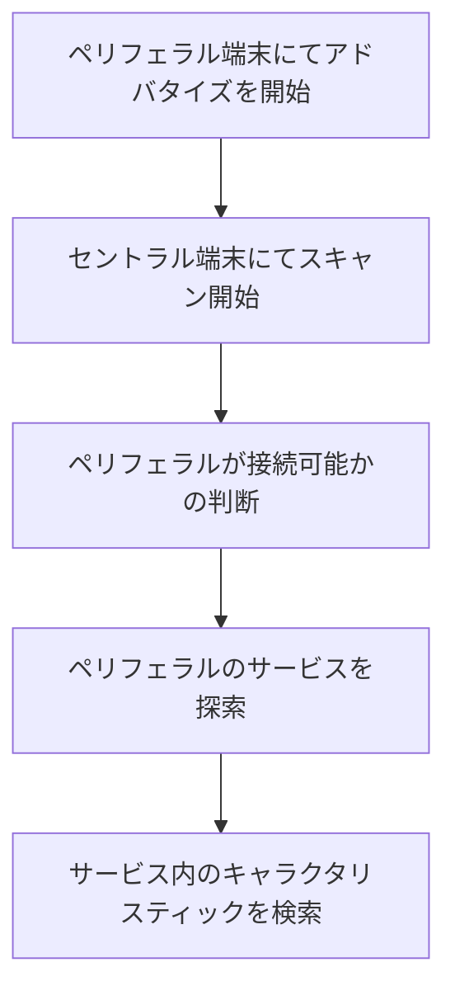

# 概要
Apple WatchとBLEデバイス（iPhone）との通信方法を解説
CoreBluetoothを使用したデータバインディング手法
カウントアップ機能
サンプルコードによる具体的な実装

# 環境
Xcode Ver14.3
iOS 15
watchOS 8.0

# 参照リンク
https://www.musen-connect.co.jp/blog/course/trial-production/ble-beginner-1/

https://yukblog.net/iphone-watch-ble/
# 詳細
以下では、サンプルコードをもとに、AppleWatchとiphoneとのBLE通信方法とデータバインディング手法を解説していきます。

# はじめに
BLEでは、通信を行う2つのデバイスがあります。セントラルデバイス(AppleWatach)とペリフェラルデバイス(iPhone)です。ペリフェラルデバイスは、アドバタイズを発信することでセントラルデバイスとの接続を開始し、接続後はセントラルデバイスからの書き込みリクエストに応答することで通信を行います。

##  CentralManagerクラスの作成
まずはじめに、AppleWatch（Central）の役割を担当するCentralManagerクラスを作成します。このクラスは、NSObject、ObservableObject、CBCentralManagerDelegate、CBPeripheralDelegateを継承しています。

```
// CentralManagerは、セントラル（Apple Watch）の役割を担当するクラスです
class CentralManager: NSObject, ObservableObject, CBCentralManagerDelegate, CBPeripheralDelegate {
    @Published var isConnected = false
    var centralManager: CBCentralManager!
    var peripheral: CBPeripheral?
    let serviceUUID = CBUUID(string: "1111")
    let characteristicUUID = CBUUID(string: "2222")
    
       

    override init() {
        super.init()
        centralManager = CBCentralManager(delegate: self, queue: nil)
        
        
    }
```

このクラスでは、CBCentralManagerを作成し、delegateを設定しています。また、ペリフェラルとの接続状態を示すisConnectedプロパティや、サービスUUID、キャラクタリスティックUUIDなどのプロパティも定義しています。

##  PeripheralManagerクラスの作成
次に、iPhone(Peripheral)の役割を担当するPeripheralManagerクラスを作成します。このクラスは、NSObject、ObservableObject、CBPeripheralManagerDelegateを継承しています。

このクラスでは、CBPeripheralManagerを作成し、delegateを設定しています。また、カウントを管理するcountプロパティや、サービスUUID、キャラクタリスティックUUIDなどのプロパティも定義しています。
```
class PeripheralManager: NSObject, ObservableObject, CBPeripheralManagerDelegate {
    
    //     カウントを管理するPublishedプロパティ
    @Published var count = 0
    // Bluetoothペリフェラルマネージャ
    var peripheralManager: CBPeripheralManager!
    // サービスとキャラクタリスティックのUUID
    let serviceUUID = CBUUID(string: "1111")
    let characteristicUUID = CBUUID(string: "２２２２")
    

    override init() {
        super.init()
        peripheralManager = CBPeripheralManager(delegate: self, queue: nil)
        
    }
```
##  BLE通信の開始



#### Step１.アドバタイズを開始
startAdvertising() 関数は、ペリフェラルとしてのアドバタイズを開始するために必要なすべての手順を実行します。これにより、セントラルデバイス（例えば、Apple Watch）がペリフェラルデバイスを検出し、サービスおよびキャラクタリスティックにアクセスしてデータの送受信ができるようになります

```
iPhone(Peripheral)側


   func startAdvertising() {
        // サービスとキャラクタリスティックを作成し、ペリフェラルマネージャに追加
        let service = CBMutableService(type: serviceUUID, primary: true)
        let characteristic = CBMutableCharacteristic(type: characteristicUUID, properties: .write, value: nil, permissions: .writeable)
        service.characteristics = [characteristic]
        peripheralManager.add(service)
        // アドバタイズ開始
　　　　　　　　　　　　　　peripheralManager.startAdvertising([CBAdvertisementDataServiceUUIDsKey: [serviceUUID]])
    }
    
```


#### Step２.   iPhone(Peripheral)のstartAdvertising()で送られてくた、サービスUUIDを持つペリフェラルをスキャン
startScanning()メソッドを使用して、iPhone(Peripheral)のstartAdvertising()でアドバタイズされた、サービスUUIDを持つペリフェラルをスキャンします。
```
AppleWatch（Central）側


//アドバタイズをスキャン
  func startScanning() {
        centralManager.scanForPeripherals(withServices: [serviceUUID], options: nil)
    }
```
#### Step３. スキャンが成功
スキャンが成功すると、centralManager(_:didDiscover:advertisementData:rssi:)デリゲートメソッドが呼ばれ、検出されたペリフェラルに接続を試みます。

このデリゲートメソッドの実装では、検出されたペリフェラルデバイスをプロパティ self.peripheral に代入しています。これにより、後で接続やデータの送受信を行う際に、このペリフェラルデバイスを参照できるようになります。
```
AppleWatch（Central）側


// ペリフェラルを検出したときに呼ばれるデリゲートメソッド
    func centralManager(_ central: CBCentralManager, didDiscover peripheral: CBPeripheral, advertisementData: [String: Any], rssi RSSI: NSNumber) {
        self.peripheral = peripheral
       
//        検出されたペリフェラルに接続を試みます。接続が成功した場合、centralManager(_:didConnect:)デリゲートメソッドが呼ばれ、失敗した場合はcentralManager(_:didFailToConnect:error:)が呼ばれます。
        central.connect(peripheral, options: nil)
    }
```
#### Step４. 接続が成功
centralManager(_:didConnect:)デリゲートメソッドが呼ばれ、ペリフェラルのサービスを探索します。
```
AppleWatch（Central）側


//接続が成功した時に呼ばれるデリゲートメソッド
    func centralManager(_ central: CBCentralManager, didConnect peripheral: CBPeripheral) {
        isConnected = true
        peripheral.delegate = self
        peripheral.discoverServices([serviceUUID])
    }
```

#### Step５. サービス見つかった時
peripheral(_:didDiscoverServices:)デリゲートメソッドが呼ばれます。
peripheral.discoverCharacteristics([characteristicUUID], for: service) の部分で、特定のUUIDに関連するキャラクタリスティックを検索しています。
```
AppleWatch（Central）側


//サービス見つかった時に呼ばれるデリゲートメソッド
 func peripheral(_ peripheral: CBPeripheral, didDiscoverServices error: Error?) {
        
        // サービスの検出中に何らかのエラーが発生,エラー内容をログに出力し、メソッドの実行を終了
        if let error = error {
            print("Error discovering services: \(error.localizedDescription)")
            return
        }
        //サービスに関連するキャラクタリスティックを検索するためのメソッドを呼び出します
        if let services = peripheral.services {
            for service in services {
                peripheral.discoverCharacteristics([characteristicUUID], for: service)
            }
        }
    }
```
####  Step６. キャラクタリスティックが見つかった時
このメソッドは、検出されたキャラクタリスティックのリストから特定のUUIDに一致するキャラクタリスティックを見つけることが目的です。これにより、そのキャラクタリスティックを使用してペリフェラルデバイスとのデータの読み取りや書き込みなどさまざまな操作を行うことができます。

```
AppleWatch（Central）側


 //    キャラクタリスティックが見つかったときに呼ばれるデリゲートメソッド。
    func peripheral(_ peripheral: CBPeripheral, didDiscoverCharacteristicsFor service: CBService, error: Error?) {
        if let characteristics = service.characteristics {
            for characteristic in characteristics {
                if characteristic.uuid == characteristicUUID {
                    print("Found characteristic")
                }
            }
        }
    }
```
## カウントアップ機能実装

###### findCharacteristic()作成
AppleWatch（Central）側にてデータを操作する前に、特定のキャラクタリスティックに対してデータを読み書きする前に、そのキャラクタリスティックが存在することを確認する。

findCharacteristic()関数を使用して、キャラクタリスティックを操作するために必要なCBCharacteristicインスタンスを取得できます。


```
AppleWatch（Central）側


 func findCharacteristic() -> CBCharacteristic? {
        guard let services = peripheral?.services else { return nil }
        for service in services {
            if let characteristics = service.characteristics {
                for characteristic in characteristics {
                    if characteristic.uuid == characteristicUUID {
                        return characteristic
                    }
                }
            }
        }
        return nil
    }
```
###### incrementCounter()でリクエスト送信
incrementCounter()メソッドは、カウンターをインクリメントするために使用されます。接続済みのペリフェラルデバイスと対象のキャラクタリスティックを取得し、1つのバイトのデータ（値が1）を書き込みます。

以下がメソッドの主な動作です。

1.findCharacteristic()関数を使用して特定のキャラクタリスティックを取得します。
2.値1を持つUInt8型の変数valueを作成します。
3.valueをData型に変換して、dataという変数に格納します。
4.writeValue(_:for:type:)メソッドを使って、データをペリフェラルの特定のキャラクタリスティックに書き込むリクエストを送信しています。このメソッドのtype引数には、.withResponseを指定しています。これにより、ペリフェラルがリクエストに対して応答を返すことが要求されます。
```
AppleWatch（Central）側


  func incrementCounter() {
        guard let peripheral = peripheral, let characteristic = findCharacteristic() else { return }
        let value: UInt8 = 1
        let data = Data([value])
        peripheral.writeValue(data, for: characteristic, type: .withResponse)
        
    }
```
###### incrementCounter()で送信された、リクエストを受信
peripheralManager(_:didReceiveWrite:)です。このメソッドは、ペリフェラルがCentralからの書き込みリクエストを受信したときに呼ばれます。

```
iPhone(Peripheral)側


    // 書き込みリクエストを受信したときに呼ばれるデリゲートメソッド
    func peripheralManager(_ peripheral: CBPeripheralManager, didReceiveWrite requests: [CBATTRequest]) {
        // 受信したリクエストを処理
        for request in requests {

//valueが1バイトの場合、count変数にその値を加算しています
            if let value = request.value, value.count == 1 {
                count += Int(value[0])

//.respond(to:withResult:)メソッドを使って、リクエストに対する応答として.success結果を送信します。
                peripheralManager.respond(to: request, withResult: .success)
            } else {
                peripheralManager.respond(to: request, withResult: .invalidAttributeValueLength)
            }
        }
    }

```
## 4. ContentViewの実装
ContentViewでは、CentralManagerとPeripheralManagerのインスタンスを@StateObjectで宣言し、Apple WatchとBLEデバイスの接接続およびデータ送受信の状況を画面上に表示します。

### CentralManagerに関連する表示と操作
CentralManagerのインスタンスcentralManagerを使って、接続状況を表示します。また、"通信を開始"ボタンを押すことで、ペリフェラルのスキャンおよび接続を開始します。

PeripheralManagerに関連する表示と操作
PeripheralManagerのインスタンスperipheralManagerを使って、カウントの状況を表示します。また、"通信を送る"ボタンを押すことで、アドバタイズを開始し、書き込みリクエストを受信できるようにします。

## 5. 実行結果
Apple WatchとBLEデバイスが正常に接続し、データが送受信されると、それぞれのデバイスの画面にカウントが増加することが確認できます。


## まとめ
この記事では、Apple WatchとBLEデバイスとの通信方法とデータバインディング手法について解説しました。サンプルコードを用いて、具体的な実装方法を説明しました。これを参考に、Apple WatchとBLEデバイスを用いたアプリ開発を行ってきたいです。


